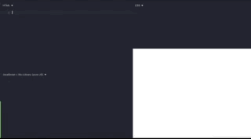

# Assessment: Todos, Part II

Previously, you wrote an application tha displayed a list of todos. For this assessment,
you'll be extending that todo application such that users can actually interact with it.

*Once again, part 1 was purely visual and no functionality. Part 2 will be focused on adding functionality*

Here's the finally product again as a reminder of what the complete product
will look like:

In doing so, you'll be demonstrating a basic understanding of the following:

- modifying component-specific values using state
- responding to user interactions by using event handlers and component methods

## Getting Started
To get started, copy your code from part 1 into a new repository.

## Acceptance Criteria

### User Can Add a Todo (3 points): 
When a user types into the top input and hits the Enter/return key, it should it as a todo and empty the input.

### User can mark a todo as complete (3 points): 
When a user clicks on the circle at the beginning of a todo it will toggle whether that todo is completed or not.

### User Can Delete a Todo (2 points): 
When a user clicks the "X" on the right of a Todo, it removes it from the list.

### User Can Delete all Todos Marked as Complete (2 points): 
When a user clicks the button 'Clear Completed' it will delete all todos that are marked as complete.

## Submission

You __will__ be required to submit a deployed application. If you instead
submit a link to a GitHub repository (that is, only code), you _will_ be awarded
__0__ points.
